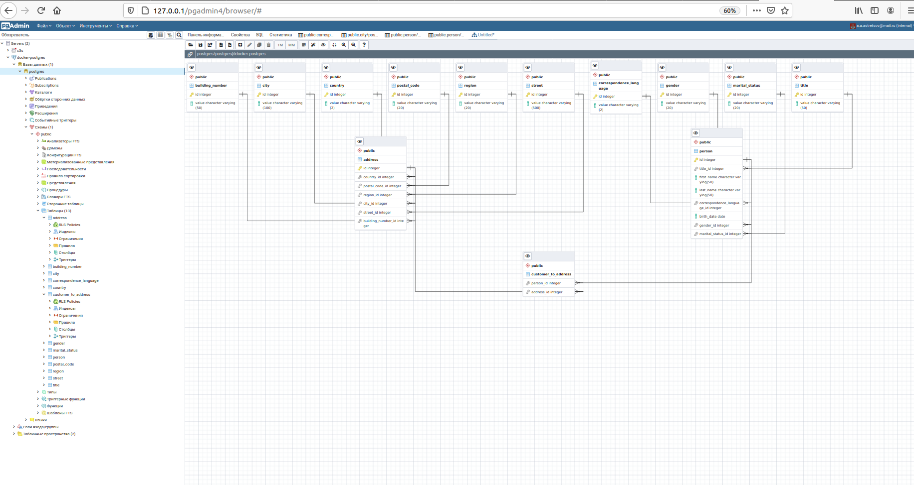
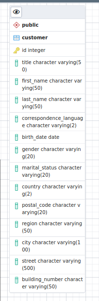

# Домашнее задание
Задача: реализовать модель данных БД, определить сущности, построить связи, выполнить декомпозицию и нормализацию

За основу берем практическую структуру данных с заказчиками интернет магазина (файл some_customers.csv.gz).

Текущая структура данных неоптимальна:
- нет типизации - почти все поля хранятся как строки
- данные не нормализованы - данные о адресе и человеке хранятся в одной таблице, на одного человека может приходится несколько адресов

Попытаться выделить следующие сущности:
- страны
- города
- улицы
- дома
и другие которые посчитаете нужными

Описанные сущности не являются полным и конечным ТЗ (как это и бывает в жизни). Вы как архитектор должны предусмотреть необходимые атрибуты и дополнительные сущности по необходимости. И четко представлять бизнес-задачу которую будет решать эта структура данных.

делаем декомпозицию и нормализацию
в качестве сделанной ДЗ принимается pdf с начальной и конечной моделью

Решая данное ДЗ вы тренируете навык проектирования БД, выделения сущностей и их атрибутов, построения связей, нормализации данных

# Реализация
Пишем скрипт инициализации [БД](docker-entrypoint-initdb.d/init.sql). В нем в комментариях описываю шаги.
В итоге получаем следующую схему:

Из исходной:

