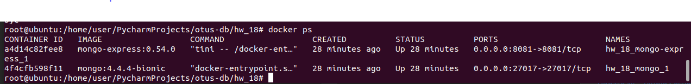
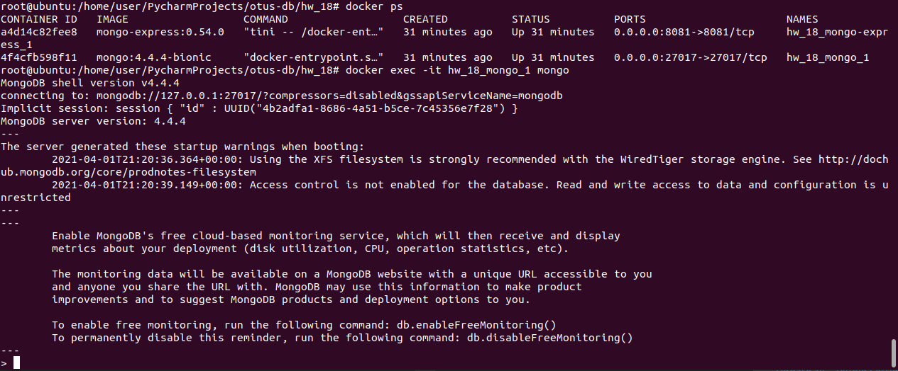
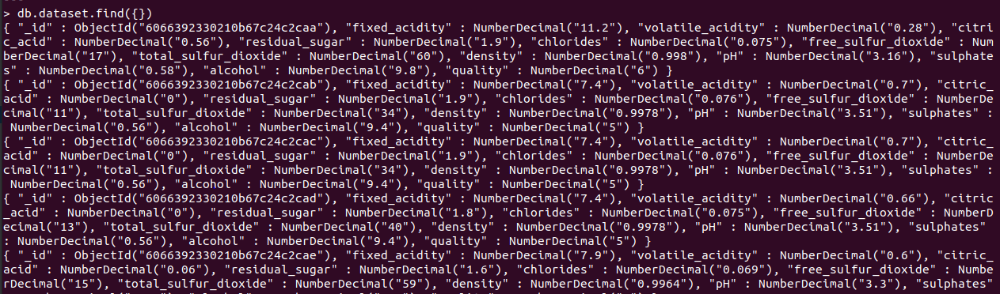
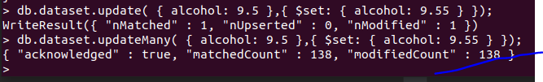
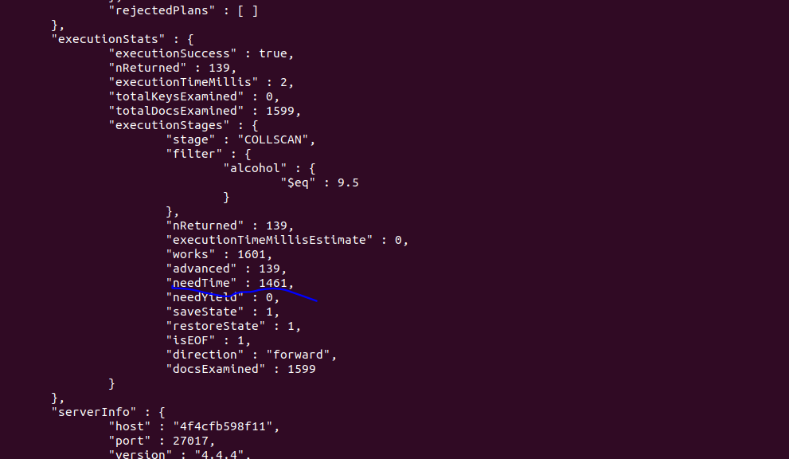
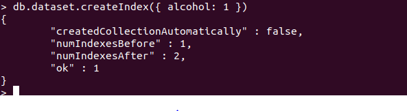
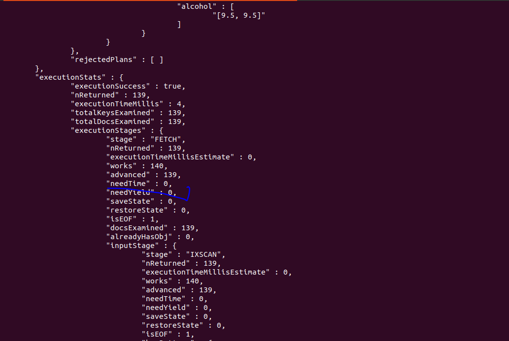

# Домашнее задание
Необходимо:

установить MongoDB одним из способов: ВМ, докер;
заполнить данными;
написать несколько запросов на выборку и обновление данных
Сдача ДЗ осуществляется в виде миниотчета.

создать индексы и сравнить производительность.
  
# Решение
* Используя образ mongo:4.4.4-bionic из документации видно, что можно добавлять скрипты инициализации (продываем в volumes [init-dataset.sh](docker-entrypoint-initdb.d/init-dataset.sh)), модифицируя наш [docker-compose.yml](docker-compose.yml)
* Выбрал dataset https://archive.ics.uci.edu/ml/datasets/wine+quality с параметрами вина, хотя вино не пью, так, ради интереса. 
* Запускаем ```docker-compose up -d```. 
  Поднялась так же админка, переходим в браузере на нее: [http://127.0.0.1:8081/db/test/dataset]() и можем в созданной БД test просмотреть через View коллекцию dataset, исследовать БД.
* Зайдем в mongo shell, для этого:
  * Узнаем название созданного контейнера: 
  * Запускаем mongo shell: 
  * Запустим разные запросы:
    * ``db.dataset.find({})``: 
    * ``db.dataset.find({ alcohol: { $gte: 7, $lte: 8 } })``
    * ``db.dataset.find({ alcohol: 9.5 })``
    * ``db.dataset.update({ alcohol: 9.5 },{ $set: { alcohol: 9.55 } });``
      
    * ``db.dataset.updateMany({ alcohol: 9.5 },{ $set: { alcohol: 9.55 } });``
      
    * etc
  *** Создадим индексы и сравним время исполнения:
    * Измерим время выполнения запросов до создания индексов:
      ``db.dataset.find({ alcohol: 9.5 }).explain("executionStats")``
      
    * Создадим индексы на всех полях:
      ``db.dataset.createIndex({ alcohol: 1 })``
      
    * Измерим время выполнения запросов после создания индексов:
      ``db.dataset.find({ alcohol: 9.5 }).explain("executionStats")``
      
# Итого
По индексации очевидно быстрее запросы. CSV с параметризаией по разделителям и т.д. не поддерживается в mongo, лучше использлвать выгрузки json.
