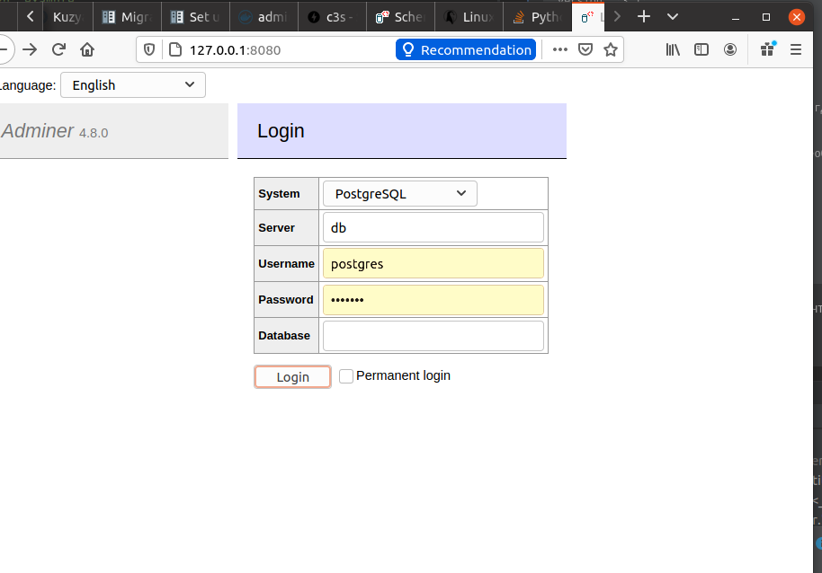
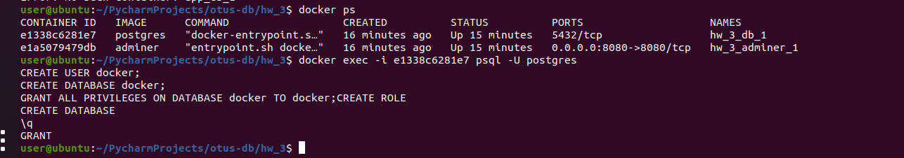
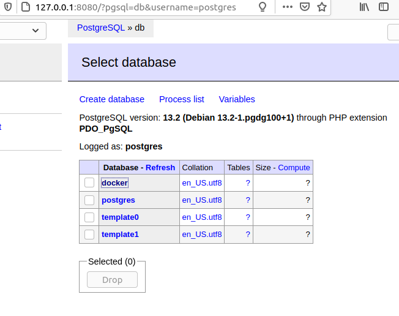
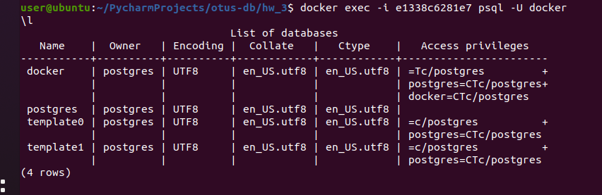

# Установка СУБД PostgreSQL 
**Цель**: создаем кластер PostgreSQL в докере или на виртуальной машине, запускаем сервер и подключаем клиента.
> 1. Развернуть контейнер с PostgreSQL или установить СУБД на виртуальную машину.
> 2. Запустить сервер.
> 3. Создать клиента с подключением к базе данных postgres через командную строку.
> 4. Подключиться к серверу используя pgAdmin или другое аналогичное приложение.

# Решение
> Я буду делать через docker-compose:
> * Ищем в https://hub.docker.com/search?q=&type=image в поле поиска *postgres*.
> * Получил первую ссылку https://hub.docker.com/_/postgres. Нахожу тело docker-compose.yml которое прикладываю в репозиторий: ().
> * Далее в текущей директории где лежит docker-compose.yml загружаю все используемые образы: ```docker-compose pull```.
> * Обращаем внимание на то, что внутри docker-compose.yml ```POSTGRES_PASSWORD: example``` и согласно документации на сайте репозитория пользователь ```postgres```.
> * Нам нужны образы с сохранением состояния БД после перезапуска контейнеров (чтобы потом использовать его где-то еще), поэтому изменяем docker-compose.yml:
> ```
> version: '3.1'
> services:
>  db:
>    image: postgres
>    restart: always
>    environment:
>      POSTGRES_PASSWORD: example
>    volumes: # добавляем volume к папке, где хранится локально вся БД
>      - pg_volume:/var/lib/postgresql
>
>  adminer: # использую adminer, но это необязательно, если расшарить порты от БД PSQL.
>    image: adminer
>    restart: always
>    ports:
>      - 8080:8080
>
>  volumes:
>    pg_volume: {}
> ```
> * Стартуем их в фоне (флаг "-d" (daemon), что значит запустить все и не ждать их окончания): ```docker-compose up -d```.
> * Теперь можем запустить http://127.0.0.1:8080/  Мы попадаем в администрирование БД: postgresql example (Username Password соответственно).
> * Можно все выполнять внутри этой оболочки, но цель создать нового пользователя БД в через командную строку.
> * Выполняем создание нового пользователя: 
> * Через adminer видим, что БД docker была создана: 
> * Через командную строку: 