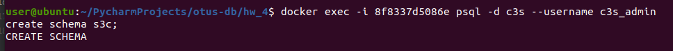

# Домашнее задание
DDL скрипты для postgres
Цель: реализация спроектированной схемы в postgres
Используя операторы DDL создайте на примере схемы интернет-магазина:
1. Базу данных.
2. Табличные пространства и роли.
3. Схему данных.
4. Таблицы своего проекта, распределив их по схемам и
табличным пространствам.
  
# Решение
* Добавляем создание БД, табличных пространств и ролей через скрипт [init-c3s.sh](docker-entrypoint-initdb.d/init-c3s.sh)
* Запускаем docker-compose и проверяем, что табличное пространство, пользователь c3s_admin и БД c3s созданы: 
* Заходим под созданным пользователем c3s и входим в БД c3s: 
* Теперь можем попробовать создать схему данных: 
* Создаем таблицы своего проекта (c3s). Распределяем их по схемам и табличным пространствам. Не вижу смысла тут сейчас использовать схему и просто создам пару таблиц в sql скрипте. Более лучшим решением это положить этот скрипт внутри docker-entrypoint-initdb.d или в уже созданный скрипт [init-c3s.sh](docker-entrypoint-initdb.d/init-c3s.sh) в секцию где выполняем SQL код.
