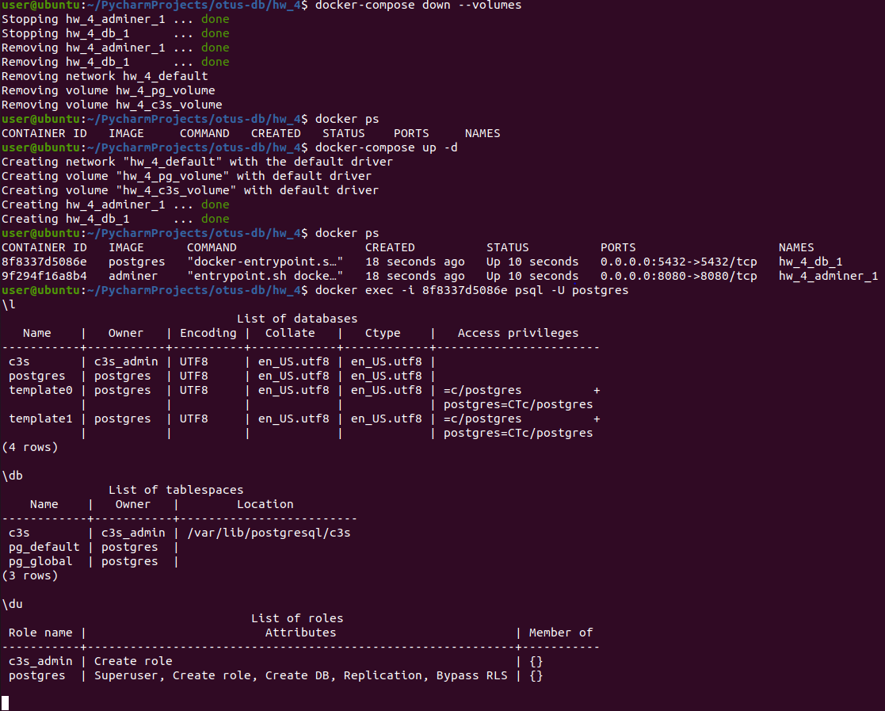
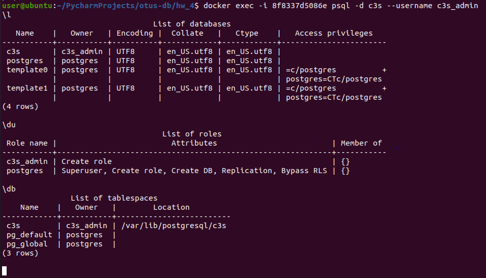
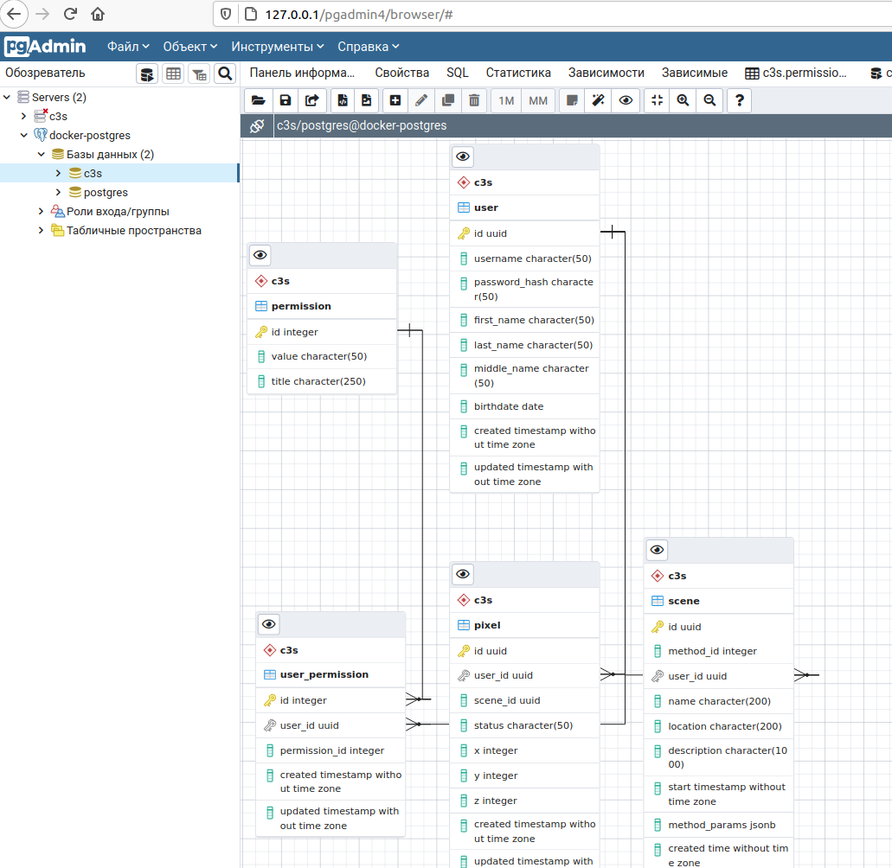

# Домашнее задание
DDL скрипты для postgres
Цель: реализация спроектированной схемы в postgres
Используя операторы DDL создайте на примере схемы интернет-магазина:
1. Базу данных.
2. Табличные пространства и роли.
3. Схему данных.
4. Таблицы своего проекта, распределив их по схемам и
табличным пространствам.
  
# Решение
* Используя образ postgres:13.2-alpine из документации видно, что можно добавлять скрипты инициализации (продываем в volumes [init-c3s.sh](docker-entrypoint-initdb.d/init-c3s.sh)), модифицируя наш [docker-compose.yml](docker-compose.yml)
* При запуске образа происходит только один раз создание табличных пространств и ролей через скрипт [init-c3s.sh](docker-entrypoint-initdb.d/init-c3s.sh) под postgres пользователем
* Далее в той же инициализации создаем уже под созданным пользователем s3c_admin схемы, таблицы и индексы(*замечания).
* После запуска ```docker-compose up -d``` смотрим через консоль: 
* Заходим под созданным пользователем c3s и входим в БД c3s: 
* В предустановленном pgAdmin4 так же можно посмотреть результаты: 

# Замечания
> Индексы не создаю, т.к. уже имел опыт с ними, включая FTS.
